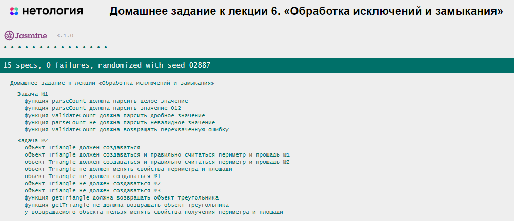

# Домашнее задание к лекции 6 «Обработка исключений и замыкания»

## Задача 1. Форматтер чисел
Ошибки случаются, и нужно уметь с ними работать. Ваши коллеги разработали форму, которая принимает от пользователя количество покупаемых единиц товара. Вас попросили написать функцию-преобразователь, которая:

* возвращает число, если всё корректно;
* генерирует ошибку, если ввод не является числом в десятичной системе счисления.

Используйте возможности стандартной библиотеки JS для преобразования строки в число.

### Что нужно сделать
1. Напишите функцию `parseCount` .
    * Аргументом функции является значение, которое необходимо распарсить.
    * Для парсинга используйте функцию `Number.parseFloat`.
    * Если результат парсинга — значение `NaN`, то выбрасывайте исключение с ошибкой *«Невалидное значение»*.
    * Верните результат парсинга из функции.

2. Напишите функцию `validateCount`.
    * Аргументом функции является значение, которое необходимо распарсить.
    * Попробуйте распарсить значение с помощью функции `parseCount`.
    * Если распарсить удаётся успешно, то возвращайте результат.
    * Перехватывайте исключение, которое может выбрасывать функция `parseCount`.
    * Возвращайте ошибку из функции в случае перехвата исключения.

## Задача 2. Треугольник 
На этот раз Вася решил создать онлайн-калькулятор геометрических фигур. Помогите ему создать калькулятор треугольников, который сможет проверять существование треугольника, считать площадь и периметр.

### Что нужно сделать
1. Напишите класс `Triangle`.
    * Конструктор класса должен принимать три стороны треугольника.
    * В случае нарушения правила существования треугольника (сумма двух сторон меньше третьей) выбрасывайте исключение с ошибкой *«Треугольник с такими сторонами не существует»*.
    * Геттер `perimeter` должен возвращать периметр треугольника.
    * Геттер `area` должен возвращать площадь треугольника. Для подсчёта площади используйте [формулу Герона](https://ru.wikipedia.org/wiki/%D0%A4%D0%BE%D1%80%D0%BC%D1%83%D0%BB%D0%B0_%D0%93%D0%B5%D1%80%D0%BE%D0%BD%D0%B0). Точность должна вычисляться с обозначением до трёх знаков после запятой.
2. Напишите функцию `getTriangle`.
    * Аргументами функции являются три значения длин сторон.
    * Попытайтесь вернуть новый объект треугольника.
    * В случае перехвата исключения возвращайте объект с двумя геттерами `area` и `perimeter`, которые возвращают строку: *«Ошибка! Треугольник не существует»*.

## Результат при правильном решении задания

## Требования к выполнению домашней работы

1. Все тесты успешно выполняются.
2. Соблюдается [кодстайл](https://github.com/netology-code/codestyle/tree/master/js#%D0%BF%D1%80%D0%B0%D0%B2%D0%B8%D0%BB%D0%B0-%D0%BE%D1%84%D0%BE%D1%80%D0%BC%D0%BB%D0%B5%D0%BD%D0%B8%D1%8F-javascript-%D0%BA%D0%BE%D0%B4%D0%B0).
3. Решение загружено в форкнутый репозиторий GitHub.
4. Решение опубликовано в GitHub Pages.

## Решение задач
1. Откройте файл `task.js` в вашем редакторе кода и выполните задание.  
2. Проверьте соблюдение [кодстайла](https://github.com/netology-code/codestyle/tree/master/js#%D0%BF%D1%80%D0%B0%D0%B2%D0%B8%D0%BB%D0%B0-%D0%BE%D1%84%D0%BE%D1%80%D0%BC%D0%BB%D0%B5%D0%BD%D0%B8%D1%8F-javascript-%D0%BA%D0%BE%D0%B4%D0%B0). Форматируйте ваш код через форматтер https://codebeautify.org/jsviewer.
3. Добавьте файл `task.js` в индекс `git` с помощью команды `git add %file-path%`, где `%file-path%` — путь до целевого файла `git add ./6.exception-closure/task.js`.  
4. Сделайте коммит, используя команду `git commit -m '%comment%'`, где `%comment%` — это произвольный комментарий к вашему коммиту `git commit -m 'Шестое задание полностью готово'`.  
5. Опубликуйте код в репозиторий `homeworks` с помощью команды `git push -u origin main`. 
6. На проверку пришлите 2 ссылки. На файл с решением (`task.js`) и на страницу GitHub Pages — страницу с автотестами: `https://%USERNAME%.github.io/bjs-2-homeworks/6.exception-closure`.

**_Никакие файлы прикреплять не нужно._**

Все задачи обязательны к выполнению для получения зачёта. Можете прислать на проверку как каждую задачу по отдельности, так и все задачи вместе. Во время проверки по частям у вашей домашней работы будет статус «На доработке».

Любые вопросы по решению задач задавайте в чате учебной группы.